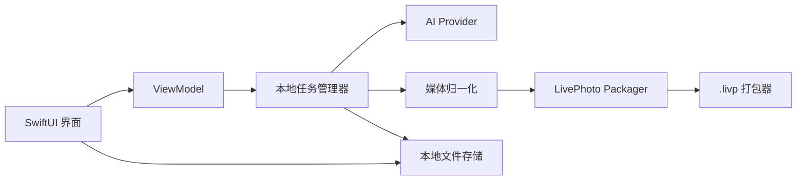

# Mac 本机可安装版技术方案

日期：2026-05-09

公开说明：本文是 Mac 本机版产品草案。当前开源仓库不包含模板媒体资产；实际生成锁屏可用 `.livp` 时，需要用户提供有权使用的 neutral template assets。

本文档描述一个可以安装在用户 Mac 上运行的本地版 Live Photo / `.livp` 生成工具。这个版本优先服务快速商业验证：用户在 Mac 上安装应用，输入提示词或导入视频，生成 iPhone 可保存、可设置锁屏动态壁纸的 `.livp` 文件。

## 1. 为什么先做 Mac 本机版

当前 `.livp` 成功链路天然依赖 macOS：

- `Swift LivePhotoPackager CLI` 使用 `AVFoundation` / `ImageIO` / `CoreGraphics`。
- FFmpeg 当前使用 `hevc_videotoolbox` 编码 HEVC。
- 已验证成功的是 macOS 打包链路生成的 compatible `.livp`。

因此 Mac 本机版可以避开第一阶段的服务器部署、macOS Worker、队列、对象存储、账号系统和支付系统，把重点放在：

- 生成质量。
- `.livp` 成功率。
- 用户导入 iPhone 的体验。
- 用户是否愿意付费。

## 2. 推荐技术选型

第一版推荐：

```text
SwiftUI
Swift Concurrency
AVFoundation
ImageIO
CoreGraphics
UniformTypeIdentifiers
本地文件存储
内置 LivePhotoPackager 代码
内置或检测 FFmpeg
```

暂不推荐 Electron / Tauri：

- 核心媒体能力已经在 Swift 里。
- 原生应用更容易调用 AVFoundation 和 VideoToolbox。
- 少一层 Node/WebView 打包和签名问题。
- 安装包更轻，用户信任感更好。

## 3. 产品形态

Mac 应用名称可以先叫：

```text
Live Wallpaper Studio
```

第一版功能：

- 输入提示词生成动态视频。
- 上传本地视频生成 `.livp`。
- 选择少量内置模板。
- 预览生成视频。
- 导出 `.livp` 文件。
- 显示 iPhone 导入指引。
- 保存本地生成历史。

第一版不做：

- 账号系统。
- 云端作品库。
- 在线支付。
- 模板市场。
- 团队协作。
- 管理后台。
- 多设备同步。

## 4. 应用架构



核心模块：

```text
App
  LiveWallpaperStudioApp.swift

Features
  GeneratorView
  JobDetailView
  HistoryView
  SettingsView

Core
  JobRunner
  AIClient
  MediaNormalizer
  LivePhotoPackager
  LivpZipWriter
  ValidationService
  LocalLibrary
```

## 5. 生成流程

```text
用户输入提示词或选择本地视频
  -> 创建本地 job
  -> 如果是提示词，调用视频生成 API
  -> 下载生成视频到本地临时目录
  -> FFmpeg 归一化到 1080x1920 / 1s / 60fps / HEVC hvc1
  -> 0.5s 抽封面
  -> 写入 MakerApple[17]
  -> 写入 MOV content.identifier
  -> 注入中性 mebx 轨道
  -> 生成 HEIC + MOV
  -> 打包 compatible `.livp`
  -> 本地校验
  -> 保存到用户选择的位置
```

## 6. 本地文件结构

应用数据目录：

```text
~/Library/Application Support/LiveWallpaperStudio/
  config.json
  templates/
    vendor-neutral-v1/
      template.heic
      template.mov
  jobs/
    {jobId}/
      input/
      ai/
      normalized/
      packaging/
      output/
      logs/
      validation-report.json
  history.json
```

用户导出的文件：

```text
~/Downloads/live-wallpaper-{date}.livp
```

## 7. FFmpeg 处理方案

有两种方式。

### 7.1 第一版：检测本机 FFmpeg

应用启动时检测：

```text
/opt/homebrew/bin/ffmpeg
/usr/local/bin/ffmpeg
```

如果找不到，提示用户安装：

```bash
brew install ffmpeg
```

优点：

- 开发最快。
- 安装包最简单。
- 适合内部测试和早期付费验证。

缺点：

- 普通用户不一定会安装 Homebrew。
- 交付体验不够完整。

### 7.2 商业版：内置 FFmpeg

应用包内置 `ffmpeg` 可执行文件：

```text
LiveWallpaperStudio.app/Contents/Resources/bin/ffmpeg
```

注意：

- 需要处理 FFmpeg license。
- 尽量使用 LGPL 兼容构建，避免引入 GPL 编码器。
- 当前链路使用 `hevc_videotoolbox`，不需要 `libx265`。
- 内置二进制需要随 App 一起签名和公证。

建议：

```text
内部测试版：先检测 Homebrew FFmpeg
公开商业版：再内置 FFmpeg
```

## 8. AI API Key 方案

第一版可以让用户在设置里填自己的 API Key：

```text
Settings
  OpenAI API Key
  Image Model
  Video Model
```

API Key 保存到 macOS Keychain，不写入普通配置文件。

商业版再升级为：

```text
用户登录
  -> 应用调用你的后端
  -> 后端代理 AI 生成
  -> 后端控制额度和计费
```

本机版早期使用用户自己的 API Key，可以避免一开始就做账号、支付、额度、风控和成本控制。

## 9. 模板资产处理

当前商业可行链路依赖 compatible neutral `mebx` 模板。

应用内需要内置：

```text
template.heic
template.mov
```

注意：

- 这两个模板资产决定 `.livp` 兼容性。
- 需要做法律和产品风险评估。
- 后续最好生成自有中性 `mebx` 模板，降低对第三方样本的依赖。

## 10. 本地历史记录

第一版不需要 SQLite，直接使用 JSON 即可：

```json
[
  {
    "jobId": "job_123",
    "createdAt": "2026-05-09T12:00:00Z",
    "prompt": "透明塑料袋在水中缓慢漂浮",
    "status": "succeeded",
    "previewPath": ".../preview.mov",
    "outputPath": ".../output.livp"
  }
]
```

当历史记录、搜索、标签、收藏变复杂后，再迁移 SQLite。

## 11. 界面设计

第一版主界面保持简单：

```text
左侧：历史记录
中间：生成工作台
右侧：预览和导出
```

工作台控件：

- 模板选择。
- 提示词输入。
- 参考视频选择。
- 生成按钮。
- 进度条。
- 预览播放器。
- 导出 `.livp`。
- 打开导出位置。

不要暴露：

- 帧率。
- 编码器。
- ZIP 结构。
- `mebx` 参数。
- `MakerApple` 元数据。

这些属于内部兼容性参数。

## 12. 安装和分发

开发测试阶段：

```text
直接运行 Xcode build
导出 unsigned .app
本机测试
```

小范围测试阶段：

```text
Developer ID 签名
Notarization 公证
DMG 分发
```

正式商业阶段：

```text
Developer ID 签名
Notarization 公证
自动更新
错误日志上报
授权码或登录体系
```

暂不建议第一版上 Mac App Store：

- 沙盒权限会让 FFmpeg、文件访问、外部工具调用更麻烦。
- 审核周期不适合快速试错。
- `.livp` 生成链路还在产品验证阶段。

## 13. 权限和安全

需要注意：

- 文件选择器让用户显式选择输入视频和导出目录。
- API Key 存 Keychain。
- 临时文件任务结束后可清理。
- 本地日志避免记录完整 API Key。
- 对用户输入内容做基本提示，不承诺生成内容版权。

如果启用 App Sandbox，需要额外处理文件访问权限和子进程执行。第一版可以先走非 Mac App Store 分发，降低沙盒约束。

## 14. 和 Web 平台的关系

Mac 本机版不是 Web 平台的替代，而是更快验证核心价值的路径。

```text
Mac 本机版
  -> 验证生成质量
  -> 验证用户导入 iPhone
  -> 验证付费意愿
  -> 积累模板和提示词

Web 平台
  -> 扩大获客
  -> 做支付和账号
  -> 做模板市场
  -> 做自动化交付
```

很多核心代码可以复用：

- `LivePhotoPackager`
- `.livp` ZIP comment 写入逻辑
- `.livp` 校验逻辑
- 视频归一化参数
- 模板资产

## 15. 推荐开发步骤

### 阶段 1：本地视频转 `.livp`

- 创建 SwiftUI Mac App。
- 把 `LivePhotoPackager` 从 CLI 抽成 Swift module。
- App 内选择本地视频。
- 调用 FFmpeg 归一化。
- 调用打包模块生成 `.livp`。
- 导出到用户选择目录。

### 阶段 2：本地历史和预览

- 保存 job 历史。
- 展示预览视频。
- 展示生成日志。
- 增加失败提示。
- 增加 `.livp` 结构校验。

### 阶段 3：AI 生成

- 设置页保存 API Key 到 Keychain。
- 接入图像生成。
- 接入视频生成。
- 生成后自动进入 `.livp` 打包链路。

### 阶段 4：可分发安装包

- App 签名。
- DMG 打包。
- Notarization 公证。
- 内置或引导安装 FFmpeg。

### 阶段 5：商业化

- 授权码。
- 简单激活服务。
- 自动更新。
- 错误日志上报。
- 模板包下载。

## 16. 第一版最小范围

建议第一版只做：

```text
选择本地视频
  -> 生成 `.livp`
  -> 导出文件
  -> 显示 iPhone 导入说明
```

不要一开始就做 AI、登录、支付、模板市场、自动更新。先把本地安装、生成、导出、真机验证这条链路打磨顺。

## 17. 当前开发入口

已创建 Mac 本机版开发目录：

```text
MacLocalApp/
  README.md
  LiveWallpaperStudio.xcodeproj
  LiveWallpaperStudio/
    LiveWallpaperStudioApp.swift
    Views/ContentView.swift
    ViewModels/GeneratorViewModel.swift
    Services/LocalLivpGenerator.swift
    Models/GenerationJob.swift
    Info.plist
```

当前已实现：

```text
选择本地视频
  -> 选择 .livp 导出位置
  -> 调用仓库根目录 scripts/make-livp.sh
  -> 在界面中显示生成日志
  -> 成功后可在 Finder 中显示输出文件
```

验证命令：

```bash
xcodebuild -project MacLocalApp/LiveWallpaperStudio.xcodeproj \
  -scheme LiveWallpaperStudio \
  -configuration Debug \
  -destination 'platform=macOS' \
  CODE_SIGNING_ALLOWED=NO \
  build
```

当前验证结果：

```text
BUILD SUCCEEDED
```
