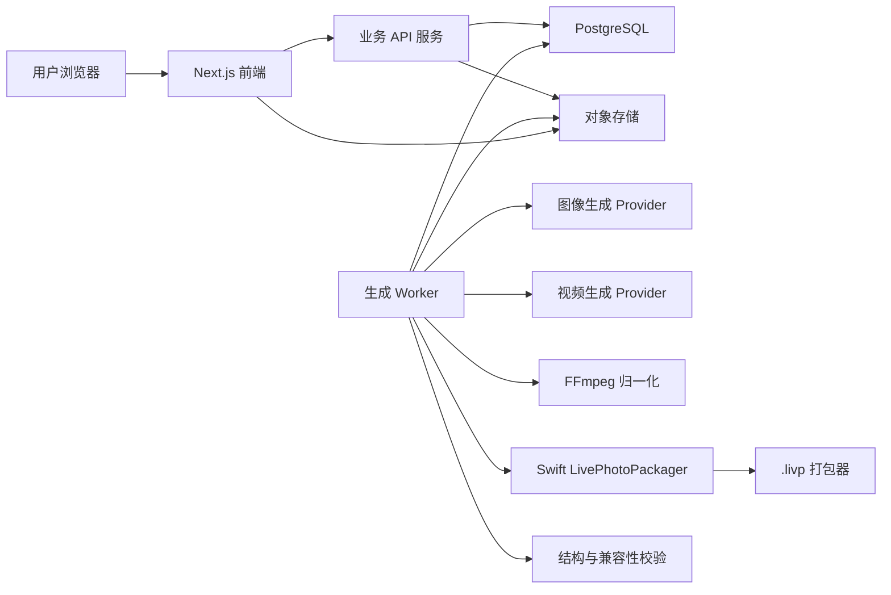
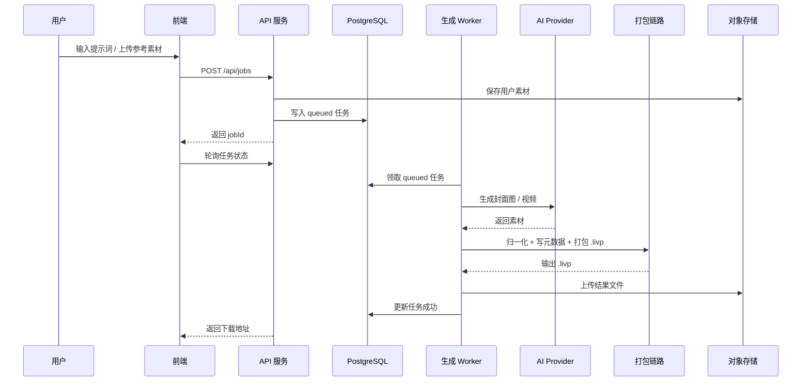

# 生产级技术文档与架构设计

日期：2026-05-09

本文档面向下一阶段生产级前后端开发，目标是把当前已验证的 `.livp` 生成能力，升级为可商业化运营的 Web 平台。

如果目标是先做可安装在用户 Mac 上运行的本地应用，见 [Mac 本机可安装版技术方案](mac-local-app.md)。

## 1. 产品目标

平台提供 AI 实况壁纸生成能力：

- 用户输入提示词、上传参考图或选择模板。
- 平台生成封面图、动态视频和 iOS 可识别的 `.livp` 文件。
- 生成结果可以通过百度网盘、Safari 下载、文件 App、AirDrop 等方式导入 iPhone。
- 导入相册后显示为 Live Photo，并且可以设置为锁屏动态壁纸。

第一版核心不是做最丰富的编辑器，而是保证交付文件稳定可用。

## 2. 已验证技术结论

当前验证结论决定生产方案：

- 只写基础 Live Photo 元数据不够，iOS Photos 可识别，但锁屏动态效果不可用。
- iPhone 原生 `mebx` 不能作为通用模板迁移到任意视频。
- 商家 `.livp` 的中性 `mebx` 轨道可以迁移到自定义视频，并可作为锁屏动态壁纸。
- `.livp` 不只是普通 ZIP 改后缀，必须包含商家风格内部文件名和 ZIP 注释。
- 当前稳定规格为 `1080x1920 / 1s / 60fps / HEVC hvc1 / 0.5s cover / silent AAC`。

因此生产 MVP 固定输出规格，不开放任意比例、任意时长、任意帧率。

## 3. 技术选型

### 3.1 前端

推荐：

```text
Next.js
React
TypeScript
Tailwind CSS 或 shadcn/ui
TanStack Query
```

原因：

- 适合快速做商业 Web 产品。
- 支持服务端渲染、静态页面、API 路由和后续 SEO。
- TypeScript 可以降低前后端接口漂移。
- TanStack Query 适合轮询异步生成任务状态。
- 第一版页面状态简单，暂不需要 Zustand/Jotai 这类全局状态库。

第一版页面：

- 首页即生成工作台，不做营销落地页。
- 生成任务页。
- 结果下载页。
- 简单模板选择可以先内置在工作台里。
- 订单、历史作品和管理后台可以后置。

### 3.2 后端

推荐：

```text
Node.js
PostgreSQL
S3 兼容对象存储
FFmpeg
Swift LivePhotoPackager CLI
```

说明：

- Node.js 负责 Web API、任务编排和业务状态；鉴权、支付可以后置。
- PostgreSQL 存储任务、作品、素材、模型调用日志和任务状态；用户、订单、支付表可以后置。
- 第一版不引入 BullMQ/Redis，后台生成进程直接从 PostgreSQL 任务表领取任务。
- 对象存储保存上传素材、AI 生成资产、`.livp`、预览图和日志文件。
- Swift CLI 继续负责 Live Photo 元数据写入和 `mebx` 轨道注入。
- NestJS 不是第一版必须项。如果开发速度优先，可以先用 Next.js API routes 或轻量 Node API；等业务模块增多后再迁移到 NestJS。

### 3.3 AI 生成

生产代码不要硬编码某个具体模型名，而是做模型适配层：

```text
ImageProvider
VideoProvider
PromptProvider
ModerationProvider
```

模型选择通过配置控制：

```text
IMAGE_PROVIDER=openai
IMAGE_MODEL=gpt-image-1.5
VIDEO_PROVIDER=openai
VIDEO_MODEL=sora-2
```

如果后续 `gpt-image-2` 或其他视频模型可用，只需要替换配置和 provider 适配器，不改业务主流程。

官方文档当前可参考：

- [OpenAI 图像生成文档](https://platform.openai.com/docs/guides/image-generation)
- [OpenAI 图像工具文档](https://platform.openai.com/docs/guides/tools-image-generation)
- [OpenAI 视频生成文档](https://platform.openai.com/docs/guides/video-generation)
- [OpenAI 视频 API 参考](https://platform.openai.com/docs/api-reference/videos/create)

## 4. 总体架构

### 4.1 第一版暂缓引入的技术

为了尽快做出可付费验证的版本，以下技术或模块先不进入第一版：

```text
Redis / BullMQ
SSE / WebSocket
Zustand / Jotai
独立管理后台
完整模板市场
订单系统和支付系统
CDN
Load Balancer
PostgreSQL 主从
复杂日志平台
复杂监控告警系统
Kubernetes
多模型调度系统
Linux 化打包链路
```

第一版保留最小闭环：

```text
用户上传视频或输入提示词
  -> 创建生成任务
  -> 后台 Worker 生成 `.livp`
  -> 用户下载
  -> iPhone 真机验证
```

暂缓这些技术不是否定它们，而是避免在商业验证前背上过多工程成本。



核心原则：

- HTTP API 只创建任务，不直接执行视频生成。
- 生成任务先写入 PostgreSQL，由后台 Worker 轮询领取并执行。
- 所有中间产物都落对象存储，方便排障和复跑。
- `.livp` 输出必须经过结构校验后才能给用户下载。

## 5. 核心业务流程

### 5.1 生成流程



### 5.2 `.livp` 打包流程

```text
输入视频
  -> FFmpeg 归一化到 1080x1920 / 1s / 60fps / HEVC hvc1
  -> 生成静音 AAC
  -> 0.5s 抽封面
  -> Swift CLI 写图片 MakerApple[17]
  -> Swift CLI 写 MOV content.identifier
  -> Swift CLI 注入中性 mebx 轨道
  -> 生成 HEIC + MOV
  -> 使用 IMB_xxxxxxxx.HEIC.heic / IMB_xxxxxxxx.HEIC.mov 作为内部文件名
  -> zip -0 -X 打包
  -> 写入 ZIP 注释
  -> 自动校验
  -> 上传对象存储
```

## 6. 前端架构

### 6.1 页面结构

```text
/                         生成工作台
/jobs/[jobId]             生成进度和结果
/works                    我的作品
/works/[workId]           作品详情和下载
```

后置页面：

```text
/templates                模板市场
/orders                   订单记录
/admin                    管理后台入口
/admin/jobs               任务排障
/admin/templates          模板管理
/admin/assets             资产管理
```

### 6.2 工作台交互

第一版工作台包含：

- 少量内置模板选择。
- 提示词输入。
- 参考图上传。
- 画面比例固定为竖屏。
- 生成按钮。
- 任务进度。
- 视频预览。
- `.livp` 下载。
- iPhone 导入说明。

不要让用户选择帧率、时长、编码格式。生产初期这些属于内部稳定性参数。

### 6.3 任务状态

前端使用轮询即可，后续再升级为 SSE 或 WebSocket。

```text
queued       排队中
generating   AI 生成中
packaging    打包中
validating   校验中
succeeded    成功
failed       失败
cancelled    已取消
```

### 6.4 下载体验

结果页展示：

- `.livp` 下载按钮。
- 预览视频。
- 文件大小。
- 生成参数。
- 推荐导入路径。
- 百度网盘导入提示。
- 常见失败原因。

## 7. 后端服务设计

### 7.1 服务拆分

MVP 可以是一个后端仓库，内部模块清晰拆分：

```text
api-service
  jobs
  assets
  works
  templates

worker-service
  image-generation
  video-generation
  media-normalization
  livephoto-packaging
  validation
```

第一版可以暂不做完整账号、订单、支付和管理后台。用户身份可以先用匿名 `sessionId` 或简单登录，等下载付费链路确定后再补完整用户体系。

第一版可以先把 API 和 Worker 放在同一个代码仓库里，但用两个进程启动：

```text
api     处理 HTTP 请求
worker 轮询 PostgreSQL 任务表并执行生成
```

业务量上来后，再考虑引入 Redis/BullMQ 或云队列。

### 7.2 API 草案

```http
POST /api/jobs
GET  /api/jobs/:jobId
POST /api/jobs/:jobId/cancel
GET  /api/works
GET  /api/works/:workId
GET  /api/works/:workId/download
GET  /api/templates
```

`uploads/presign`、支付接口和管理后台接口可以第二阶段再加。

创建任务请求：

```json
{
  "templateId": "tpl_float_bag",
  "prompt": "透明塑料袋在水中缓慢漂浮，柔和光线，竖屏壁纸",
  "referenceAssetId": "asset_123",
  "outputSpec": "ios-live-wallpaper-v1"
}
```

任务状态响应：

```json
{
  "jobId": "job_123",
  "status": "packaging",
  "progress": 72,
  "stage": "livephoto_packaging",
  "previewUrl": "https://cdn.example.com/preview.mp4",
  "downloadUrl": null,
  "error": null
}
```

### 7.3 任务幂等

每个生成任务必须有：

- `jobId`
- `idempotencyKey`
- `inputHash`
- `modelConfigSnapshot`
- `packagingSpecVersion`
- `attempt`

同一用户重复提交相同请求时，可以复用结果或防止重复扣费。

### 7.4 PostgreSQL 任务领取

第一版不单独引入队列中间件，Worker 直接从 `jobs` 表领取任务。

推荐领取逻辑：

```sql
UPDATE jobs
SET
  status = 'generating',
  locked_by = $1,
  locked_at = now(),
  attempt = attempt + 1,
  updated_at = now()
WHERE id = (
  SELECT id
  FROM jobs
  WHERE status = 'queued'
  ORDER BY created_at ASC
  FOR UPDATE SKIP LOCKED
  LIMIT 1
)
RETURNING *;
```

需要增加字段：

```text
locked_by
locked_at
attempt
last_error_at
```

Worker 每次只领取一个任务，执行完成后更新状态。进程异常退出时，可以通过 `locked_at` 超时把任务重新置为 `queued` 或 `failed`。

## 8. 数据库设计

### 8.1 核心表

```text
users
  id
  email
  phone
  auth_provider
  created_at

templates
  id
  name
  cover_asset_id
  prompt_preset
  status
  created_at

assets
  id
  owner_user_id
  type
  storage_key
  mime_type
  size_bytes
  width
  height
  duration_ms
  checksum
  created_at

jobs
  id
  user_id
  template_id
  status
  progress
  stage
  prompt
  input_asset_id
  output_work_id
  locked_by
  locked_at
  attempt
  error_code
  error_message
  last_error_at
  packaging_spec_version
  model_config_json
  created_at
  updated_at

works
  id
  user_id
  job_id
  preview_asset_id
  livp_asset_id
  source_video_asset_id
  status
  created_at

orders
  id
  user_id
  work_id
  amount
  currency
  payment_provider
  payment_status
  created_at

generation_logs
  id
  job_id
  stage
  provider
  request_id
  latency_ms
  cost_estimate
  status
  created_at
```

第一版最小表可以只有：

```text
jobs
assets
works
templates
generation_logs
```

`users` 可以用匿名 `sessionId` 过渡；`orders` 等支付链路跑通后再加。

### 8.2 关键版本字段

`works` 或 `jobs` 中必须记录：

```text
packaging_spec_version = ios-live-wallpaper-v1
template_mebx_version = vendor-neutral-v1
zip_comment_version = livp-comment-v1
ffmpeg_profile = 1080x1920-1s-60fps-hvc1-v1
```

未来如果调整 2 秒、30fps 或自研中性 `mebx`，可以按版本灰度。

## 9. 对象存储结构

```text
users/{userId}/uploads/{assetId}/source
jobs/{jobId}/inputs/source
jobs/{jobId}/ai/image.png
jobs/{jobId}/ai/video.mp4
jobs/{jobId}/normalized/video.mov
jobs/{jobId}/packaging/live-photo.heic
jobs/{jobId}/packaging/live-photo.mov
jobs/{jobId}/outputs/output.livp
jobs/{jobId}/logs/ffmpeg.log
jobs/{jobId}/logs/packager.log
jobs/{jobId}/validation/report.json
```

生产环境不要只保留最终 `.livp`。中间产物是排障、复跑和质量分析的基础。

第一版如果不做登录，可以把 `users/{userId}` 改成：

```text
sessions/{sessionId}/uploads/{assetId}/source
```

## 10. 质量校验

每次生成后必须自动校验。

### 10.1 视频校验

```text
分辨率 = 1080x1920
时长 = 1.0s
帧率 = 60fps
编码 = HEVC hvc1
音频 = AAC
封面时间 = 0.5s
```

### 10.2 Live Photo 校验

```text
图片存在 MakerApple[17]
MOV 存在 content.identifier
图片 UUID 与视频 UUID 一致
MOV 存在 live-photo-info mebx 轨道
MOV 存在 still-image-time 轨道
live-photo-info 样本数量符合当前模板
```

### 10.3 `.livp` 校验

```text
ZIP 内部只有 HEIC/JPG + MOV
内部文件名符合 IMB_xxxxxxxx.HEIC.heic/mov
ZIP 使用 store 模式或与样本兼容的模式
ZIP 注释存在
ZIP 注释 offset/size 与真实文件一致
末尾包含 1000LIVP 标记
```

校验失败的文件不能进入下载态。

## 11. 部署架构

### 11.1 MVP 部署

```text
Vercel / Node Web
  -> API 服务

云服务器 / GPU 或 CPU Worker
  -> FFmpeg
  -> Swift CLI
  -> 打包器

托管 PostgreSQL
S3 / R2 / OSS / COS
```

如果 AI 生成使用外部 API，Worker 不一定需要 GPU，但需要稳定 CPU、磁盘和较好的网络。

CDN 可以后置。第一版下载量不大时，对象存储签名 URL 或 API 透传下载已经够用。

### 11.2 生产部署

```text
Load Balancer
  -> API Service x N
  -> Worker Service x N
  -> Admin Service

PostgreSQL 主从
对象存储 + CDN
日志系统
监控告警
```

后续如果任务量变大，再升级为队列架构：

```text
PostgreSQL 任务表
  -> Redis / BullMQ
  -> image-generation queue
  -> video-generation queue
  -> packaging queue
  -> validation queue
```

## 12. 安全与风控

### 12.1 用户内容安全

- 上传文件大小限制。
- 上传 MIME 和真实格式校验。
- 提示词内容审核。
- 生成结果审核。
- 禁止违法、侵权、成人、公众人物滥用等内容。

### 12.2 系统安全

- API 鉴权。
- 下载链接短期签名。
- 对象存储私有桶。
- 生成接口限流。
- 每用户并发任务限制。

管理后台权限和支付 webhook 验签等到对应模块上线时再做。

### 12.3 成本控制

- 用户提交任务前预估成本。
- AI 调用失败重试次数有限。
- 包装失败只重跑包装，不重跑 AI。
- 免费用户低并发。
- 高成本模型仅付费用户可用。

## 13. 支付与商业化

商业化可以按阶段推进。

验证期先不急着接支付系统，建议先做：

```text
免费生成少量样本
人工收款或邀请码发放下载权限
记录用户是否成功设置锁屏
验证用户是否愿意为结果付费
```

确认需求后再接正式支付：

```text
免费预览
付费下载 .livp
单张购买
套餐点数
模板专题包
```

订单状态：

```text
created
pending
paid
fulfilled
refunded
failed
```

扣费建议发生在生成成功后下载前，减少“用户付费但生成失败”的客服成本。

## 14. 可观测性

必须记录：

- 每个 job 的阶段耗时。
- AI provider request id。
- FFmpeg 日志。
- Swift packager 日志。
- `.livp` 校验报告。
- 下载次数。
- 用户反馈的导入路径和失败原因。

关键指标：

```text
生成成功率
打包成功率
校验通过率
平均生成耗时
P95 生成耗时
单任务平均成本
用户反馈的锁屏成功率
```

支付转化率、退款率等指标等正式支付上线后再加入。

## 15. 灰度策略

所有会影响兼容性的参数都必须版本化：

```text
ios-live-wallpaper-v1
  1080x1920
  1s
  60fps
  HEVC hvc1
  vendor-neutral mebx v1
  livp ZIP comment v1
```

新规格不能直接替换：

```text
ios-live-wallpaper-v2
  2s
  60fps
  new neutral mebx
```

每个版本都要有真实 iPhone 验证矩阵。

## 16. 研发里程碑

### 阶段 1：生产骨架

- Next.js 前端工程。
- Node API 工程。
- PostgreSQL schema。
- 基于 PostgreSQL 的任务表和后台 Worker。
- 对象存储接入。
- 当前 `make-livp.sh` 封装为 Worker 任务。

### 阶段 2：生成闭环

- 接入图像生成 provider。
- 接入视频生成 provider。
- 完成任务状态页。
- 完成 `.livp` 下载。
- 增加结构校验。

### 阶段 3：商业闭环

- 用户系统。
- 订单系统。
- 支付 webhook。
- 作品库。
- 下载鉴权。
- 简单管理后台。

### 阶段 4：稳定性

- 生成失败重试。
- Worker 横向扩容。
- 日志和基础告警。
- 多 iOS 版本验证矩阵。
- 导入渠道验证。

## 17. 当前代码到生产代码的迁移

当前文件：

```text
scripts/make-livp.sh
Sources/LivePhotoPackager/main.swift
tools/set-livp-zip-comment.js
web/server.mjs
web/static/*
```

迁移方式：

```text
保留 Swift CLI 和打包工具
  -> 抽成 packages/livephoto-packager

保留 make-livp.sh 的逻辑
  -> 改成 worker 内部 MediaPipeline

废弃当前 web/server.mjs
  -> 替换为 Node API + PostgreSQL 任务表

保留 web/static 的交互验证经验
  -> 替换为 Next.js 工作台
```

## 18. 近期必须补的工程测试

- `.livp` ZIP 注释单元测试。
- `.livp` 内部文件名测试。
- FFmpeg 输出规格测试。
- MOV `mebx` 轨道存在性测试。
- 图片和视频 UUID 一致性测试。
- 失败任务重试测试。
- 大文件上传测试。
- 并发生成测试。

## 19. 风险清单

### 19.1 技术风险

- iOS 后续版本改变锁屏动态壁纸校验规则。
- 第三方导入渠道改变 `.livp` 识别逻辑。
- 不同 AI 视频模型输出导致压缩后观感不稳定。
- 当前中性 `mebx` 来源需要进一步合法性评估。

### 19.2 产品风险

- 用户不知道如何导入相册和设置锁屏。
- 百度网盘等渠道体验不稳定。
- 生成内容质量不稳定影响付费转化。

### 19.3 合规风险

- 使用购买 `.livp` 作为逆向参考需要法律评估。
- 模板、提示词、生成结果可能涉及版权或肖像权。
- 付费下载前后需要明确退款规则。

## 20. 推荐下一步

立即进入生产开发时，建议按这个顺序：

1. 建立 `apps/web` 和 `apps/api`。
2. 建立 `packages/livephoto`，把现有打包链路包进去。
3. 建立 PostgreSQL schema 和 job 任务表。
4. 先支持“上传视频 -> 生成 `.livp`”的生产级异步任务。
5. 再接 AI 图像和视频生成。
6. 用真实用户验证导入、锁屏和付费意愿。
7. 最后接支付、模板市场和管理后台。

这样可以先把最关键的 `.livp` 交付链路工程化，再把 AI 和商业化能力接上去。

## 21. Swift LivePhotoPackager CLI 的环境依赖

当前 `Swift LivePhotoPackager CLI` 不是纯 Swift 跨平台程序，它依赖 Apple 平台媒体框架，因此生产部署需要特别处理。

### 21.1 代码层依赖

`Sources/LivePhotoPackager/main.swift` 使用了：

```text
AVFoundation
CoreGraphics
ImageIO
UniformTypeIdentifiers
Foundation
```

关键能力：

- `ImageIO` 读取图片、写入 HEIC/JPG、写入 `MakerApple[17]`。
- `AVFoundation` 读取 MOV、复制 video/audio/metadata track、写入 QuickTime metadata。
- `AVAssetReader` / `AVAssetWriter` 负责保留和迁移 `mebx` metadata track。
- `UniformTypeIdentifiers` 负责输出图片格式标识。

这些能力依赖 macOS/iOS 系统框架，普通 Linux 服务器没有这些框架。

### 21.2 构建层依赖

当前 `Package.swift` 声明：

```text
platforms: macOS v13+
swift-tools-version: 5.9
```

构建机器需要：

```text
macOS 13 或更高
Xcode 或 Command Line Tools
Swift 5.9 或更高
```

本机已验证环境：

```text
Xcode 26.4.1
```

生产环境可以在 CI 中编译出二进制，再分发到 macOS Worker。运行时仍然需要 macOS，因为二进制链接 Apple 系统框架。

### 21.3 完整打包链路依赖

`scripts/make-livp.sh` 除了 Swift CLI，还依赖：

```text
ffmpeg
hevc_videotoolbox
swift run livephoto-packager
node
python3
zip
uuidgen
vendor-livp/IMB_ZyUbrU.HEIC.heic
vendor-livp/IMB_ZyUbrU.HEIC.mov
```

其中 `hevc_videotoolbox` 是 Apple VideoToolbox 硬件/系统编码器，也要求 macOS。若要在 Linux 上运行，需要把 FFmpeg 编码参数改成 `libx265`，但这会改变编码链路，需要重新做 iPhone 锁屏兼容性验证。

### 21.4 生产部署结论

MVP 阶段推荐：

```text
API 服务：Linux 容器 / 普通云服务器
数据库：托管 PostgreSQL
生成 Worker：macOS 机器
```

可选 macOS Worker 来源：

```text
Mac mini 自托管
MacStadium
AWS EC2 Mac
其他支持 macOS 的 CI/服务器供应商
```

不推荐第一版直接把打包链路迁移到 Linux。原因是当前通过真实 iPhone 验证成功的是 macOS AVFoundation + VideoToolbox + vendor-style `.livp` 这条链路，换成 Linux 原生 MP4/MOV/HEIC 库后需要重新验证所有锁屏兼容性。

### 21.5 推荐生产形态

```text
Web/API 服务
  -> 创建 job
  -> 写入 PostgreSQL 任务表

macOS Worker
  -> 轮询并领取 job
  -> 下载输入素材
  -> 调用 FFmpeg + Swift CLI + ZIP comment 工具
  -> 校验 `.livp`
  -> 上传对象存储
  -> 回写 job 状态
```

macOS Worker 应该做成无状态服务：

- 不保存长期用户数据。
- 本地只使用临时目录。
- 每个 job 结束后清理中间文件。
- 所有输入、输出、日志都上传对象存储。

### 21.6 未来 Linux 化可能性

未来可以评估重写打包器，以降低 macOS Worker 成本：

```text
图片元数据：libheif / exiftool / ImageMagick
MOV metadata：Bento4 / GPAC / FFmpeg / 自研 MOV box 写入
mebx track：自研 QuickTime box 复制和时间轴重写
ZIP comment：当前 Node 工具可跨平台保留
HEVC 编码：libx265 或云转码服务
```

但这条路线需要重新验证：

- iOS Photos 是否仍识别 Live Photo。
- iPhone 锁屏动态效果是否可用。
- 百度网盘等第三方导入路径是否仍能保存。
- 不同 iOS 版本是否一致。

所以短期商业化优先选择 macOS Worker，长期再做 Linux 化降本。
